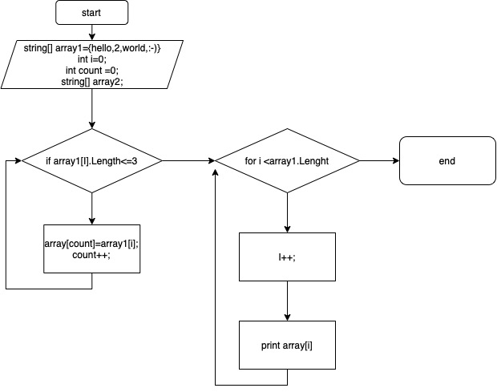

***Задача.***
Написать программу,которая из имеющегося массива строк формирует массив из строк,
длина которого меньше либо равна 3 символа. Первоначалальный массив можно ввести с клавиатуры, либо задать на старте выполнения алгоритма. При решении не рекомендуется пользоваться коллекциями, лучше обойтись исключчительно массивами.

**Решение:**
1. Задаем строковый массив с фиксированными элементами;
2. Создаем второй массив;
3. Задаем метод для получения доступа к каждому элементу массива и в цикле сравневаем каждый элемент массива с условием (длина элемента меньше либо равна 3 символа) count раз с шагом в 1, заносим каждое значение удовлетворяющие кретерию в новый массив;
4. Задаем метод вывода через цикл for. Выводим на консоль вновь полученный массив через запятую.
**БЛОК-СХЕМА**
